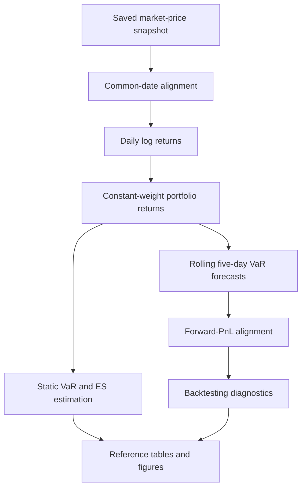
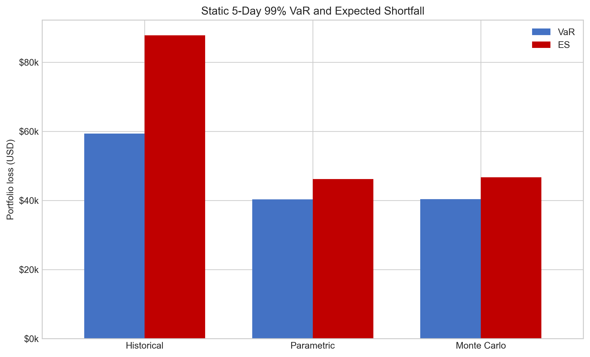
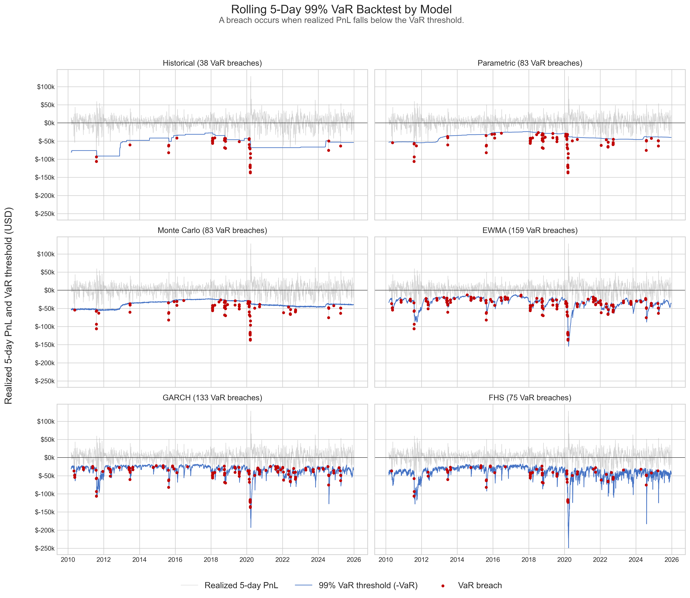
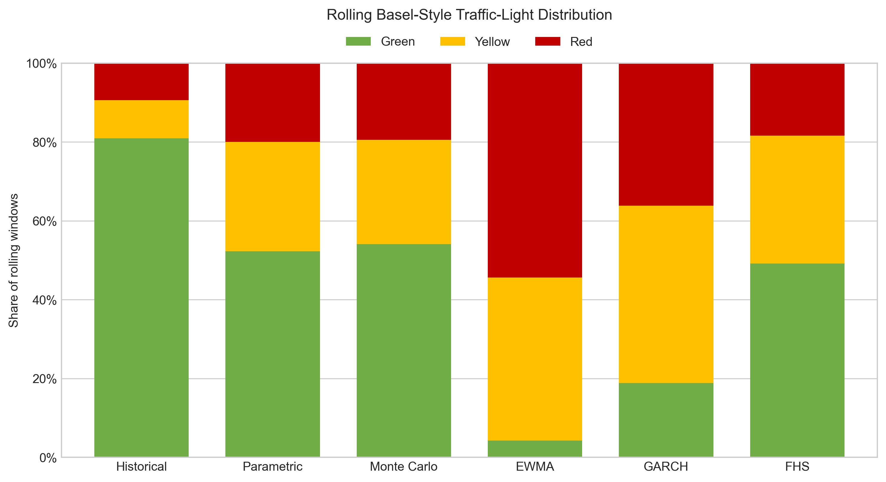

# Market Risk Validation Framework

An end-to-end Python framework for rolling VaR forecasting, forward-PnL backtesting, and comparative model validation.

## Overview

This project applies and interprets several Value-at-Risk (VaR) methodologies within a common portfolio and model-validation framework. Its primary objective is to examine how different modeling assumptions affect estimated market risk and whether the resulting VaR forecasts are consistent with realized portfolio losses.

Historical Simulation, variance-covariance VaR, and Monte Carlo Simulation are first used to compare static risk estimates and their underlying distributional assumptions. The analysis then moves from point-in-time measurement to rolling five-day VaR forecasts, with each forecast aligned to the realized forward PnL at the same forecast origin.

Model performance is evaluated through violation frequencies, unconditional coverage, violation independence, conditional coverage, and Basel-style traffic-light diagnostics. Overlapping and non-overlapping backtesting samples are reported separately to distinguish model calibration from dependence mechanically introduced by multi-day PnL windows.

EWMA, GARCH(1,1), and Filtered Historical Simulation are subsequently introduced to examine whether time-varying volatility and empirically resampled shocks improve tail-risk measurement relative to the baseline models. Expected Shortfall is included as a supplementary static measure of loss severity beyond the VaR threshold.

Rather than treating VaR as a single reported number, the project focuses on three practical questions:

* How do methodology and distributional assumptions affect estimated VaR?
* Do observed losses breach the forecasts at a frequency consistent with the stated confidence level?
* How should backtesting results be interpreted when the holding period creates overlapping realized PnL?

## Key Findings

* **Historical VaR provided the best overall calibration in this reference run.** Its violation rate was 1.01% in the full overlapping sample and 0.80% in the non-overlapping sample, both close to the 1% rate implied by a 99% VaR model.

* **Parametric and Monte Carlo VaR materially underestimated tail risk.** Both produced an overlapping violation rate of 2.21%. Their results were nearly identical because both models used the same historical covariance structure and normal-distribution assumption.

* **Dynamic volatility modeling did not automatically improve coverage.** EWMA and Rolling GARCH produced violation rates of 4.22% and 3.48%, respectively. Updating conditional volatility was not sufficient to capture the observed multi-day tail losses under normal innovations, despite the models’ different volatility dynamics and horizon aggregation methods.

* **FHS was the strongest volatility-based extension.** Its 1.99% violation rate was materially lower than those of EWMA and GARCH because it combined GARCH volatility filtering with empirically resampled standardized residuals. However, it still exceeded the expected 1% rate and did not achieve full coverage at the 5% significance level.

* **Coverage and independence provide different information.** Historical VaR passed the non-overlapping Kupiec coverage test with a p-value of 0.561, while its independence p-value of 0.034 indicated some remaining evidence of breach dependence. Its joint conditional-coverage p-value was 0.089.

* **Full overlapping and non-overlapping samples are reported separately.** The non-overlapping sample reduces the mechanical serial dependence created by overlapping five-day PnL windows and provides a more appropriate basis for the independence and conditional-coverage tests.

## Reference Portfolio and Configuration

The portfolio is intentionally simplified to provide a transparent environment for comparing model behavior. It is not intended to replicate the positions, risk factors, or operational constraints of a trading-desk portfolio.

### Portfolio Composition

| Asset                               | Ticker  | Market exposure                       | Weight | Price field    |
| ----------------------------------- | ------- | ------------------------------------- | -----: | -------------- |
| KOSPI Composite Index               | `^KS11` | Broad Korean main-board equities      |    25% | Close          |
| Kosdaq Composite Index              | `^KQ11` | Korean secondary-market and growth-oriented equities |    25% | Close          |
| iShares 7–10 Year Treasury Bond ETF | `IEF`   | Intermediate US Treasury bonds        |    25% | Adjusted Close |
| S&P 500 Index                       | `^GSPC` | US large-cap equities                 |    25% | Close          |

IEF uses Adjusted Close to reflect distributions and other price adjustments. The equity indices use unadjusted closing index levels.

### Reference Run

| Setting                          | Reference value                              |
| -------------------------------- | -------------------------------------------- |
| Sample period                    | 2006-01-03 to 2025-12-30                     |
| Price observations               | 4,774                                        |
| Rolling backtesting observations | 3,764                                        |
| Non-overlapping observations     | 753                                          |
| Portfolio notional               | USD 1,000,000                                |
| Portfolio weights                | Constant 25% weights                         |
| Return measure                   | Daily log returns                            |
| VaR confidence level             | 99%                                          |
| Holding period                   | 5 trading days                               |
| Monte Carlo simulations          | 10,000                                       |
| EWMA decay factor                | 0.94                                         |
| EWMA initialization window       | 60 observations                              |
| Rolling estimation window        | 1,000 observations for baseline, GARCH, and FHS models |
| GARCH specification              | Zero-mean GARCH(1,1) with normal innovations |
| FHS simulations                  | 2,000 per forecast                           |
| FX assumption                    | FX-neutral; exchange-rate movements and hedging costs are not modeled |
| Random seed                      | 42                                           |
| Reference run identifier         | market-risk-2006-2025-seed42                 |

### Data and Modeling Conventions

* Market data are obtained through Yahoo Finance and preserved in a local snapshot for reproducible reference results.
* Asset return series are aligned to their common available dates before portfolio returns are calculated.
* Constant portfolio weights are applied to each day’s asset returns, corresponding to an implicitly rebalanced constant-mix portfolio rather than a buy-and-hold allocation.
* Parametric, Monte Carlo, EWMA, and GARCH VaR assume zero expected return over the short forecast horizon.
* Parametric, Monte Carlo, and EWMA VaR use square-root-of-time scaling. Rolling GARCH VaR instead aggregates the model-implied daily conditional-variance forecasts over the five-day holding period.
* KOSPI and Kosdaq are included to broaden the test portfolio beyond US markets and expose the models to local-equity returns with different volatility and tail characteristics. Korean index returns are evaluated in local-currency terms, while the USD 1 million portfolio value serves only as a common notional for converting returns into monetary VaR and PnL. The results therefore represent an FX-neutral methodological benchmark rather than the realized risk of an unhedged USD investor.

## Methodology

The framework separates point-in-time risk measurement from forecast validation. Static VaR and Expected Shortfall provide an initial comparison of model assumptions, while rolling VaR forecasts evaluate whether those assumptions remain consistent with subsequently realized losses.

At each rolling forecast origin, only information available before that date is used for model estimation. The resulting five-day VaR forecast is then aligned with the portfolio PnL realized over the following five trading days.

### Framework Workflow



The analysis proceeds through the following stages:

1. Daily market prices are loaded from the saved reference snapshot.
2. Asset price series are aligned to their common available dates.
3. Daily log returns are calculated and aggregated using constant portfolio weights.
4. Historical, Parametric, and Monte Carlo methods are used to estimate static VaR and ES.
5. Rolling forecasts are generated using Historical, Parametric, Monte Carlo, GARCH, and FHS models, while EWMA volatility is updated recursively.
6. Each VaR forecast is aligned with the realized forward five-day portfolio PnL.
7. Forecast performance is evaluated through violation counts, coverage tests, independence tests, and traffic-light diagnostics.
8. Consolidated results are saved as reproducible tables and converted into comparison figures.

### Risk Models

#### Historical Simulation

Historical Simulation estimates VaR directly from the empirical distribution of portfolio outcomes without imposing a parametric return distribution.

For the static estimate, daily portfolio log returns are aggregated into overlapping five-day PnL observations. VaR is defined as the negative lower-tail empirical quantile:

```
VaR_α = -Q_(1-α)(PnL)
```

where `α` is the confidence level.

The rolling implementation applies the same empirical-quantile method to the preceding 1,000 five-day PnL observations at each forecast origin. Because it preserves realized skewness, kurtosis, and extreme historical losses, Historical Simulation provides a non-parametric benchmark. Its forecasts nevertheless remain dependent on the relevance and composition of the selected historical window.

#### Parametric VaR

Parametric VaR uses the covariance matrix of daily asset returns to estimate portfolio volatility:

```
σ_p = sqrt(w'Σw)
```

where `w` is the portfolio-weight vector and `Σ` is the return covariance matrix.

Under the assumptions of zero expected return, normally distributed returns, and independent daily innovations, five-day VaR is calculated as:

```
VaR_(t,h) = V * z_α * σ_(p,t) * sqrt(h)
```

where `V` is portfolio notional, `z_α` is the standard-normal quantile associated with confidence level `α`, and `h` is the holding period. The rolling model re-estimates the covariance matrix from the preceding 1,000 daily return observations.

#### Monte Carlo VaR

Monte Carlo VaR estimates the asset-return covariance matrix and generates correlated shocks from a multivariate normal distribution with zero mean. Simulated asset returns are aggregated using the portfolio weights and scaled to the five-day horizon under the independent-normal return assumption.

VaR is obtained from the lower tail of the simulated portfolio PnL distribution:

```
VaR_α = -Q_(1-α)(PnL_sim)
```

The reference run uses 10,000 simulations for both the static estimate and each rolling forecast. Because the Parametric and Monte Carlo models share the same covariance structure, zero-mean assumption, normal distribution, and time scaling, their VaR estimates are expected to be similar apart from simulation error.

#### Expected Shortfall

Expected Shortfall is included as a supplementary static measure of loss severity beyond the VaR threshold:

```
ES_α = -E[PnL | PnL ≤ -VaR_α]
```

Historical ES is calculated as the average loss among empirical observations exceeding Historical VaR. Parametric ES uses the closed-form normal-distribution expression:

```
ES_α = V * σ_p * φ(z_α) / (1 - α) * sqrt(h)
```

where `φ(z_α)` is the standard-normal probability density evaluated at `z_α`. Monte Carlo ES is calculated as the average simulated loss beyond the simulated VaR threshold.

ES is not subjected to rolling backtesting in the current framework and is therefore interpreted only as a complementary comparison of tail-loss magnitude.

#### EWMA VaR

The EWMA model allows portfolio volatility to change over time by assigning greater weight to recent squared returns:

```
σ_t² = λσ_(t-1)² + (1 - λ)r_(t-1)²
```

The reference configuration uses a decay factor of `λ = 0.94` and initializes the variance recursion using the first 60 observations. Under zero expected return and normal innovations, daily EWMA volatility is converted into five-day VaR using square-root-of-time scaling:

```
VaR_t(5) = V * z_α * σ_t * sqrt(5)
```

Unlike the rolling-window models, EWMA does not repeatedly estimate model parameters from a fixed 1,000-observation window. It updates conditional variance recursively using the fixed decay factor.

#### GARCH VaR

The GARCH model represents conditional variance using a zero-mean GARCH(1,1) specification:

```
σ_t² = ω + α_GARCH * r_(t-1)² + β * σ_(t-1)²
```

where:

```
ω       = long-run variance component
α_GARCH = sensitivity to recent return shocks
β       = volatility persistence
```

The notation `α_GARCH` distinguishes the GARCH shock coefficient from the VaR confidence level `α`.

At each forecast origin, the model is re-estimated using only the preceding 1,000 portfolio-return observations. This rolling design prevents future observations from influencing earlier forecasts.

Rather than applying square-root-of-time scaling to a single daily volatility estimate, the model generates daily conditional-variance forecasts over the five-day holding period. Five-day normal VaR is calculated from the sum of those forecast variances:

```
VaR_t(5) = V * z_α * sqrt(σ̂²_(t|t-1) + σ̂²_(t+1|t-1) + ... + σ̂²_(t+4|t-1))
```

This preserves the GARCH model’s forecast dynamics and potential mean reversion in conditional variance over the holding period.

#### Filtered Historical Simulation

Filtered Historical Simulation combines rolling GARCH volatility estimation with empirical shock resampling.

At each forecast origin, a zero-mean GARCH(1,1) model is fitted to the preceding 1,000 portfolio returns. Historical returns are divided by their fitted conditional volatilities to obtain standardized residuals:

```
z_t = r_t / σ_t
```

The model then draws shocks from the empirical distribution of these standardized residuals and propagates conditional variance recursively along simulated five-day paths. Each simulated return is generated as:

```
r_sim,t = σ_sim,t * z_draw,t
```

The reference run generates 2,000 paths per forecast and estimates VaR from the lower tail of the resulting simulated PnL distribution.

Although a normal distribution is specified when estimating the GARCH volatility filter, the FHS scenarios themselves are generated from empirical standardized residuals. The simulated shocks can therefore retain non-normal characteristics that are excluded from the normal-innovation GARCH VaR model.

### Backtesting Design

#### Forecast and PnL Alignment

A valid VaR backtest requires the forecast and realized loss to refer to the same holding period. At forecast origin `t`, the framework estimates five-day VaR using information available through `t-1`. Realized forward PnL is then constructed from portfolio returns observed from `t` through `t+4`:

```
PnL_t(5) = V * [r_(p,t) + r_(p,t+1) + ... + r_(p,t+4)]
```

Because portfolio log returns are multiplied directly by notional, this represents a linearized monetary PnL measure. All VaR forecasts and realized PnL series are restricted to their common dates before validation statistics are calculated.

VaR is reported as a positive loss magnitude. A violation occurs when the realized portfolio loss exceeds the forecast:

```
I_t = 1 if PnL_t(5) < -VaR_t(5)
I_t = 0 otherwise
```

For a correctly calibrated 99% VaR model, the expected violation probability is 1%.

#### Overlapping Sample

The full backtesting sample contains a forecast at each available trading date. Consecutive five-day PnL observations therefore share four daily returns. This provides the largest available sample for evaluating overall violation frequency and the time variation of VaR, but it also creates mechanical serial dependence between adjacent realized outcomes.

The full overlapping sample is used to report:

* VaR paths and realized PnL
* Violation counts and violation rates
* Kupiec unconditional-coverage results
* Rolling Basel-style traffic-light diagnostics

#### Non-Overlapping Sample

A non-overlapping sample is constructed by retaining every fifth aligned VaR and PnL observation using a fixed starting offset. The retained holding periods do not share daily returns, reducing the mechanical dependence created by overlapping five-day PnL windows.

This procedure does not guarantee independent violations because dependence may remain through volatility clustering, structural changes, or model misspecification. It nevertheless provides a more appropriate sample for evaluating violation independence and joint conditional coverage.

The non-overlapping sample is used to report:

* Kupiec unconditional coverage
* Christoffersen violation independence
* Christoffersen conditional coverage

#### Kupiec Unconditional Coverage Test

The Kupiec test evaluates whether the observed violation probability is consistent with the expected probability implied by the VaR confidence level.

The null hypothesis is:

```
H0: P(I_t = 1) = 1 - α
```

For the 99% VaR forecasts used in this project:

```
H0: P(I_t = 1) = 0.01
```

The likelihood-ratio statistic compares the expected violation probability with the observed violation rate and is asymptotically distributed as chi-square with one degree of freedom:

```
LR_UC ~ χ²(1)
```

A small p-value indicates that the model produces either too many or too few violations relative to its stated confidence level.

#### Christoffersen Independence Test

The Christoffersen independence test evaluates whether violations occur independently over time. It compares a constant violation probability with a first-order Markov alternative in which the probability of a violation depends on the preceding violation state.

The test is constructed from four transition counts:

```
n_00 = no violation followed by no violation
n_01 = no violation followed by a violation
n_10 = violation followed by no violation
n_11 = violation followed by a violation
```

The null and alternative hypotheses can be expressed as:

```
H0: π_01 = π_11
H1: π_01 ≠ π_11
```

Under the null hypothesis, the likelihood-ratio statistic is asymptotically distributed as chi-square with one degree of freedom:

```
LR_IND ~ χ²(1)
```

Rejection indicates that violations exhibit statistically significant temporal dependence or clustering.

#### Christoffersen Conditional Coverage Test

The conditional-coverage test jointly evaluates correct violation frequency and violation independence:

```
LR_CC = LR_UC + LR_IND
```

The joint null hypothesis is that the model has both correct unconditional coverage and independent violations:

```
H0: correct coverage and independent violations
```

Under the joint null hypothesis, the statistic is asymptotically distributed as chi-square with two degrees of freedom:

```
LR_CC ~ χ²(2)
```

A model can therefore pass the unconditional-coverage test while failing conditional coverage if its violations are clustered over time.

#### Basel-Style Traffic-Light Diagnostic

For each model, the framework counts violations within rolling 250-observation windows and assigns a diagnostic zone:

| Zone   | Violations |
| ------ | ---------: |
| Green  |        0–4 |
| Yellow |        5–9 |
| Red    | 10 or more |

These thresholds are used as an intuitive Basel-style diagnostic rather than as a formal regulatory backtest. The project evaluates five-day overlapping VaR forecasts, whereas the regulatory traffic-light framework is conventionally associated with a different backtesting setup.

## Results

The results are reported in four stages. Static VaR and ES compare full-sample risk estimates, while rolling backtesting evaluates forecast performance through realized violations. Overlapping and non-overlapping samples are then compared before the dynamic volatility models are examined in greater detail.

All monetary results are expressed using the common USD 1 million portfolio notional.

### Static VaR and ES Results

Historical, Parametric, and Monte Carlo methods are first applied to the full return sample to compare their single full-sample estimates of five-day market risk.

| Model       |           VaR | Expected Shortfall |
| ----------- | ------------: | -----------------: |
| Historical  | USD 59,357.36 |      USD 87,801.69 |
| Parametric  | USD 40,329.81 |      USD 46,204.43 |
| Monte Carlo | USD 40,364.75 |      USD 46,724.69 |



Historical Simulation produces substantially higher VaR and ES than the two normal-based models. Its ES also lies much further above its VaR threshold, indicating that the empirical distribution contains more severe tail losses than those represented by the normal-distribution assumption.

Parametric and Monte Carlo estimates are very similar. Both methods use the same historical covariance structure, assume zero expected returns and multivariate normality, and apply square-root-of-time scaling. The small difference between their estimates is attributable to Monte Carlo sampling variation.

The Monte Carlo convergence check produced the following estimates:

| Simulations | Monte Carlo VaR |
| ----------: | --------------: |
|         500 |   USD 37,441.23 |
|       3,000 |   USD 38,898.31 |
|      10,000 |   USD 40,275.23 |
|      50,000 |   USD 40,302.34 |

The estimate becomes progressively more stable as the number of simulations increases. The difference between the 10,000- and 50,000-simulation estimates is approximately USD 27, supporting the use of 10,000 simulations as a reasonable balance between numerical stability and computational cost.

This convergence exercise uses separate sequential simulation draws, so its 10,000-simulation estimate does not exactly equal the headline Monte Carlo VaR reported in the static comparison.

### Rolling Backtesting Results

Rolling backtesting evaluates whether the five-day VaR forecasts are consistent with subsequently realized portfolio losses. The full sample contains 3,764 overlapping forecast observations.

| Model         |   Average VaR | Violations | Violation Rate | Kupiec p-value |
| ------------- | ------------: | ---------: | -------------: | -------------: |
| Historical    | USD 56,454.66 |         38 |          1.01% |          0.953 |
| Parametric    | USD 38,241.95 |         83 |          2.21% |         <0.001 |
| Monte Carlo   | USD 38,222.97 |         83 |          2.21% |         <0.001 |
| EWMA          | USD 32,684.73 |        159 |          4.22% |         <0.001 |
| Rolling GARCH | USD 33,832.95 |        131 |          3.48% |         <0.001 |
| FHS           | USD 40,779.50 |         75 |          1.99% |         <0.001 |



A correctly calibrated 99% VaR model would be expected to produce a violation rate close to 1%. Historical VaR records 38 violations, almost exactly matching the approximately 38 violations expected over 3,764 observations. Its Kupiec p-value of 0.953 provides no evidence against correct unconditional coverage.

Parametric and Monte Carlo VaR both record 83 violations. Their identical violation counts and nearly identical average VaR reflect their shared covariance structure and normal-distribution assumption. Both models materially underestimate the frequency of large portfolio losses.

EWMA produces the lowest average VaR and the highest violation rate. Rolling GARCH improves on EWMA but still records more than three times the expected violation rate. FHS provides the strongest coverage among the volatility-based extensions, although its 1.99% violation rate remains materially above the 1% target.

The rolling 250-observation traffic-light diagnostics provide an additional view of model behavior over time:

| Model         | Average Violations |  Green | Yellow |    Red |
| ------------- | -----------------: | -----: | -----: | -----: |
| Historical    |               2.68 | 80.96% |  9.65% |  9.39% |
| Parametric    |               5.78 | 52.31% | 27.72% | 19.98% |
| Monte Carlo   |               5.78 | 54.13% | 26.41% | 19.46% |
| EWMA          |              10.92 |  4.24% | 41.41% | 54.35% |
| Rolling GARCH |               9.00 | 18.90% | 44.99% | 36.11% |
| FHS           |               5.26 | 49.15% | 32.50% | 18.36% |



Historical VaR remains in the green zone for approximately 81% of the rolling windows. By contrast, EWMA is classified as red in more than half of the windows. Rolling GARCH reduces the proportion of red classifications relative to EWMA, while FHS produces the most favorable traffic-light distribution among the dynamic extensions.

These classifications are used as descriptive Basel-style diagnostics. They should not be interpreted as the outcome of a formal regulatory backtest because the project uses overlapping five-day VaR forecasts.

### Overlapping vs. Non-Overlapping Analysis

Consecutive observations in the full sample share four of their five daily returns. To reduce the resulting mechanical dependence, every fifth aligned forecast and PnL observation is retained in a separate non-overlapping sample.

The non-overlapping sample contains 753 observations.

| Model         | Overlapping Violation Rate | Non-Overlapping Violations | Non-Overlapping Violation Rate | Kupiec p-value | Independence p-value | Conditional Coverage p-value |
| ------------- | -------------------------: | -------------------------: | -----------------------------: | -------------: | -------------------: | ---------------------------: |
| Historical    |                      1.01% |                          6 |                          0.80% |          0.561 |                0.034 |                        0.089 |
| Parametric    |                      2.21% |                         17 |                          2.26% |          0.003 |                0.394 |                        0.008 |
| Monte Carlo   |                      2.21% |                         17 |                          2.26% |          0.003 |                0.394 |                        0.008 |
| EWMA          |                      4.22% |                         30 |                          3.98% |         <0.001 |                0.482 |                       <0.001 |
| Rolling GARCH |                      3.48% |                         25 |                          3.32% |         <0.001 |                0.256 |                       <0.001 |
| FHS           |                      1.99% |                         15 |                          1.99% |          0.016 |                0.435 |                        0.040 |


The Historical model remains close to the expected 1% violation rate after overlapping observations are removed. Its Kupiec p-value of 0.561 does not reject correct unconditional coverage. However, its independence p-value of 0.034 indicates evidence of violation dependence at the 5% significance level. When coverage and independence are tested jointly, the conditional-coverage p-value is 0.089, which does not reject the joint null at the 5% level.

Parametric and Monte Carlo VaR continue to produce violation rates above 2%. Their independence tests do not reject independent violations, but their Kupiec and conditional-coverage tests are rejected. Their principal weakness in the non-overlapping sample is therefore insufficient coverage rather than statistically significant violation clustering.

EWMA and Rolling GARCH also fail the unconditional- and conditional-coverage tests by wide margins. Their independence p-values exceed 5%, indicating that removal of overlapping observations substantially reduces evidence of clustering. Nevertheless, their violation rates remain too high for a 99% VaR model.

FHS records the same 1.99% violation rate in both samples. Its independence test does not reject, but its Kupiec p-value of 0.016 and conditional-coverage p-value of 0.040 remain below 5%. FHS therefore improves materially on EWMA and Rolling GARCH without fully achieving the target coverage.

The general ranking of the models is stable across the two samples. The high violation rates of the weaker models cannot be attributed solely to mechanical dependence from overlapping five-day PnL.

### Dynamic Model Comparison

The dynamic models are designed to determine whether time-varying volatility and alternative shock distributions improve VaR performance relative to the baseline normal models.

| Model         | Volatility Treatment                                | Shock Distribution               |   Average VaR | Overlapping Violation Rate | Non-Overlapping Violation Rate | Conditional Coverage p-value |
| ------------- | --------------------------------------------------- | -------------------------------- | ------------: | -------------------------: | -----------------------------: | ---------------------------: |
| EWMA          | Recursive fixed-decay variance                      | Normal                           | USD 32,684.73 |                      4.22% |                          3.98% |                       <0.001 |
| Rolling GARCH | Rolling GARCH(1,1) with five-day variance forecasts | Normal                           | USD 33,832.95 |                      3.48% |                          3.32% |                       <0.001 |
| FHS           | Rolling GARCH(1,1) with simulated variance paths    | Empirical standardized residuals | USD 40,779.50 |                      1.99% |                          1.99% |                        0.040 |

EWMA responds to recent squared returns but applies a fixed decay factor and normal time scaling. Its low average VaR and high violation rate indicate that volatility updating alone does not provide adequate protection against the observed five-day tail losses.

Rolling GARCH provides a more flexible volatility process and generates five-day VaR from the sum of model-implied conditional-variance forecasts. It records 28 fewer violations than EWMA and a lower proportion of red traffic-light windows. Nevertheless, its violation rate remains well above the 1% target, showing that more flexible variance dynamics do not by themselves resolve the coverage problem under normal innovations.

FHS uses the same rolling GARCH(1,1) volatility structure but replaces normally distributed future shocks with empirical standardized residuals. It records 75 violations, compared with 131 for Rolling GARCH and 159 for EWMA. This improvement is consistent with the empirical residual distribution retaining tail characteristics that are absent from the normal-innovation models.

FHS nevertheless produces approximately twice the target violation rate and marginally rejects conditional coverage at the 5% level. Empirical shock resampling improves tail-risk measurement, but it does not fully capture the most severe realized losses in the reference sample.

Overall, the dynamic-model results distinguish volatility dynamics from shock-distribution assumptions. Updating conditional volatility improves responsiveness, but the assumed shape of the standardized shock distribution remains an important determinant of VaR coverage. Historical Simulation provides the strongest overall calibration in this reference run, while FHS performs best among the volatility-based extensions.

## Repository Structure

```text
market-risk-validation-framework/
├── Market_Risk_Framework.py
├── visualize_results.py
├── README.md
├── data/
│   └── market_prices_2006-01-01_2025-12-31.csv
├── results/
│   └── reference_run/
│       ├── run_config.json
│       ├── static_var_es_summary.csv
│       ├── monte_carlo_convergence.csv
│       ├── rolling_var_forecasts.csv
│       └── backtesting_summary.csv
└── figures/
    ├── static_var_es_comparison.png
    ├── rolling_var_backtests.png
    ├── violation_rate_comparison.png
    └── traffic_light_distribution.png
```

### Main Analysis

[`Market_Risk_Framework.py`](Market_Risk_Framework.py) contains the complete estimation and validation pipeline:

* Market-data loading and return construction
* Static VaR and Expected Shortfall estimation
* Rolling VaR forecasting
* Forward-PnL construction and alignment
* Kupiec and Christoffersen tests
* Basel-style traffic-light diagnostics
* EWMA, Rolling GARCH, and FHS extensions
* Reference-result export

### Visualization

[`visualize_results.py`](visualize_results.py) reads the saved reference outputs and generates the figures used in this README. Separating visualization from estimation allows figures to be reproduced without rerunning the computationally intensive rolling models.

### Data

[`data/market_prices_2006-01-01_2025-12-31.csv`](data/market_prices_2006-01-01_2025-12-31.csv) is the saved market-price snapshot used for the reference run. When this file is available, the framework loads it directly rather than downloading new observations.

The snapshot preserves a fixed dataset for reproducibility while the data-loading function retains the ability to obtain prices from Yahoo Finance when a local snapshot is unavailable.

### Reference Outputs

The [`results/reference_run`](results/reference_run) directory contains the reproducible outputs used throughout the README:

| File                          | Description                                                                                                      |
| ----------------------------- | ---------------------------------------------------------------------------------------------------------------- |
| `run_config.json`             | Reference-run identifier, portfolio settings, model parameters, data range, and selected environment information |
| `static_var_es_summary.csv`   | Static Historical, Parametric, and Monte Carlo VaR and ES estimates                                              |
| `monte_carlo_convergence.csv` | Monte Carlo VaR estimates across different simulation counts                                                     |
| `rolling_var_forecasts.csv`   | Realized forward PnL and aligned rolling VaR forecasts for all models                                            |
| `backtesting_summary.csv`     | Violation rates, likelihood-ratio tests, p-values, and traffic-light results                                     |

### Figures

The [`figures`](figures) directory contains the visual summaries generated from the saved reference outputs. These figures are reproducible outputs rather than manually prepared illustrations.

## How to Run

Clone the repository and install the required packages:

```bash
git clone https://github.com/ByCraftsman/market-risk-validation-framework.git
cd market-risk-validation-framework
python -m pip install numpy pandas scipy matplotlib yfinance arch
```

Run the main estimation and backtesting pipeline:

```bash
python Market_Risk_Framework.py
```

When the saved price snapshot is available, the script uses it to reproduce the reference run. If the snapshot is unavailable, market data are downloaded through Yahoo Finance and saved locally.

After the result tables have been generated, create the figures with:

```bash
python visualize_results.py
```

Outputs are written to:

```text
results/reference_run/
figures/
```

Rolling GARCH and FHS are re-estimated at each forecast origin, so the main framework may require substantial execution time.

## Modeling Assumptions and Limitations

The framework is designed as a transparent methodological comparison rather than a production trading-desk risk system. Its results should therefore be interpreted within the following assumptions and limitations.

### Portfolio Construction

* The portfolio contains four broad market exposures with constant weights of 25%.
* Applying the same weights to each day’s returns corresponds to an implicitly rebalanced constant-mix portfolio rather than a buy-and-hold allocation.
* Transaction costs, taxes, bid-ask spreads, funding costs, and rebalancing costs are excluded.
* The portfolio does not contain derivatives, options, short positions, nonlinear payoffs, or position-level risk-factor mappings.

### Return and PnL Measurement

* Portfolio returns are constructed from daily log returns.
* Five-day PnL is approximated by multiplying cumulative log return by portfolio notional.
* This is a linearized monetary PnL measure rather than an exact mark-to-market change calculated from compounded portfolio value.
* The approximation is generally small for ordinary returns but can become more noticeable during extreme market movements.

### Price-Series Conventions

* IEF returns are calculated from Adjusted Close and therefore reflect distributions and other price adjustments.
* KOSPI, Kosdaq, and S&P 500 returns are calculated from unadjusted closing index levels and exclude dividends.
* The portfolio therefore combines a distribution-adjusted ETF return series with price-index return series.
* This difference is retained for simplicity but prevents the component returns from representing a fully harmonized total-return portfolio.

### Cross-Market Alignment

* Korean and US market series are restricted to their common available dates.
* Because the markets operate in different time zones and observe different holidays, matching date labels do not necessarily represent perfectly synchronous closing times or identical return intervals.
* Common-date alignment removes missing observations but does not eliminate potential nonsynchronous-trading effects.

### Currency Treatment

* KOSPI and Kosdaq returns are evaluated in local-currency terms.
* The USD 1 million amount is used as a common notional for converting modeled returns into monetary VaR and PnL.
* Exchange-rate movements, currency hedging, and hedging costs are not modeled.
* The results therefore represent an FX-neutral methodological benchmark rather than the realized risk of an unhedged USD investor.

### Distributional and Volatility Assumptions

* Parametric and Monte Carlo VaR assume zero expected returns, multivariate normality, and a stable covariance structure within each estimation window.
* Parametric, Monte Carlo, and EWMA VaR use square-root-of-time scaling over the five-day holding period.
* EWMA uses a fixed decay factor rather than an estimated mean-reverting volatility process.
* Rolling GARCH assumes a zero conditional mean and normally distributed innovations but aggregates model-implied daily variance forecasts over the holding period.
* FHS replaces normally distributed simulated shocks with empirical standardized residuals, but it still assumes that the fitted GARCH dynamics and historical residual distribution remain relevant for the forecast period.
* Historical Simulation is non-parametric, but its estimates are sensitive to the selected historical window and to the extreme observations contained within that window.

### Estimation-Window Interpretation

* Rolling Historical VaR uses the preceding 1,000 overlapping five-day PnL observations.
* Rolling Parametric, Monte Carlo, GARCH, and FHS models use the preceding 1,000 daily return observations.
* EWMA is initialized from 60 observations and subsequently updated recursively rather than estimated from a rolling 1,000-observation window.
* The common window label therefore does not imply that every model uses an identical underlying statistical sample.

### Backtesting Limitations

* Consecutive five-day PnL observations in the full sample overlap and share four daily returns.
* Sampling every fifth observation reduces this mechanical dependence but does not guarantee independent violations.
* The non-overlapping analysis uses one fixed starting offset. Alternative offsets could produce somewhat different violation counts and test results.
* Reducing the sample from 3,764 to 753 observations also reduces statistical power.
* Kupiec and Christoffersen tests rely on asymptotic chi-square approximations, which should be interpreted cautiously when the number of violations is small.
* The Basel traffic-light thresholds are used as an intuitive diagnostic and not as a formal regulatory backtest of the five-day models.

### Simulation and Reproducibility

* Monte Carlo and FHS estimates contain simulation error.
* A fixed random seed improves reproducibility within the reference pipeline, but numerical results can still vary across library versions, optimization routines, and computing environments.
* The saved snapshot and reference configuration improve repeatability but do not constitute a fully controlled production model environment.

### Interpretation of Model Rankings

The reported rankings are specific to the selected portfolio, sample period, confidence level, holding period, estimation windows, and modeling assumptions. Historical VaR’s strong performance in this reference run should not be interpreted as evidence that it will dominate other methodologies across different portfolios or market regimes.

Similarly, failure to reject a backtesting null hypothesis does not prove that a model is correct. It indicates only that the available sample does not provide sufficient statistical evidence against the tested property.

## Project Evolution

The framework was developed incrementally from a static risk-measurement exercise into a broader model-validation project.

| Stage                             | Development                                                                                                   |
| --------------------------------- | ------------------------------------------------------------------------------------------------------------- |
| 1. Static risk measurement        | Implemented Historical, Parametric, and Monte Carlo VaR for a common multi-asset portfolio                    |
| 2. Tail-risk comparison           | Added Expected Shortfall and Monte Carlo convergence analysis                                                 |
| 3. Rolling validation             | Introduced rolling VaR forecasts and forward-looking five-day PnL alignment                                   |
| 4. Statistical backtesting        | Added Kupiec unconditional coverage, Christoffersen independence, and conditional-coverage tests              |
| 5. Dependence-aware analysis      | Separated overlapping and non-overlapping backtesting samples                                                 |
| 6. Dynamic volatility models      | Added EWMA, Rolling GARCH(1,1), and Filtered Historical Simulation                                            |
| 7. Forecast-integrity improvement | Replaced full-sample GARCH filtering with rolling estimation and multi-period conditional-variance forecasts  |
| 8. Reproducible reporting         | Added a saved data snapshot, reference configuration, consolidated CSV outputs, and standalone visualizations |

This progression reflects the project’s central objective: moving beyond the calculation of a single VaR number toward a framework that examines model assumptions, forecast alignment, statistical coverage, violation dependence, and the interpretation of model failure.

Potential extensions include:

* Student-t or skewed-Student GARCH innovations
* Rolling Expected Shortfall backtesting
* Alternative non-overlapping sampling offsets
* Explicit FX conversion and currency-risk modeling
* Fully harmonized total-return data
* Additional portfolio and stress-period comparisons
* Modular configuration files and automated tests


