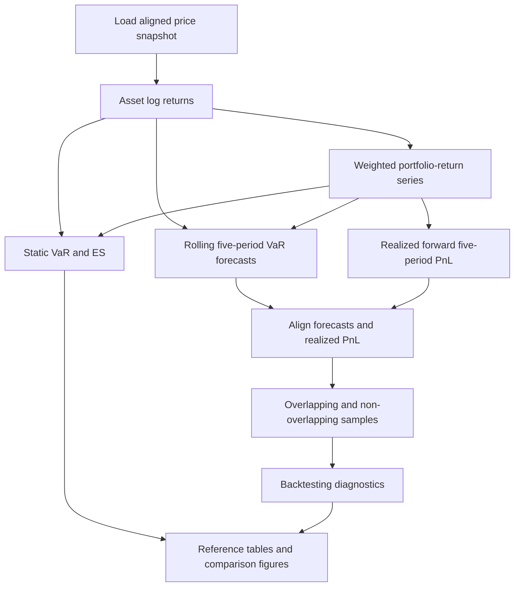

# Market Risk Validation Framework

A Python-based framework for multi-model Value-at-Risk (VaR) estimation, rolling forecasting, forward-PnL backtesting, and comparative model validation.

## Overview

This project compares six VaR methodologies. It covers static VaR and Expected Shortfall estimation, rolling five-day VaR forecasting, and validation against aligned forward portfolio PnL.

The baseline models are Historical Simulation, Parametric (Variance-Covariance), and Monte Carlo Simulation VaR. Expected Shortfall is included as a supplementary static measure of loss severity beyond the VaR threshold. The rolling analysis is then extended with EWMA, GARCH(1,1), and Filtered Historical Simulation to examine whether time-varying volatility and empirical residual resampling improve tail-risk measurement relative to the baseline models.

Model performance is evaluated using violation counts and rates, the Kupiec unconditional-coverage test, the Christoffersen independence and conditional-coverage tests, and Basel-style traffic-light diagnostics. Results are reported for both overlapping and non-overlapping samples to distinguish model calibration from the mechanical dependence introduced by overlapping five-day PnL windows.

Together, these components apply established static and dynamic VaR methodologies, examine the implications of their underlying assumptions, and implement a methodologically consistent rolling backtesting framework. The analysis is structured around six practical questions:

* How can Historical Simulation, Parametric, and Monte Carlo VaR be applied consistently to the same portfolio and holding period?
* How do empirical and normal-distribution-based methods differ in their estimates of VaR and Expected Shortfall?
* How do EWMA and rolling GARCH(1,1) perform under normal innovations, and what changes when Filtered Historical Simulation replaces normal shocks with empirically resampled standardized residuals?
* How should rolling five-day VaR forecasts be constructed and aligned with forward portfolio PnL to prevent look-ahead bias and horizon mismatches?
* Do rolling 99% VaR forecasts produce the expected 1% violation rate, and do violations occur independently over time?
* How does overlap in five-day PnL windows affect backtesting results and their statistical interpretation?

## Key Findings

### Static VaR and Expected Shortfall

* **Historical Simulation produced substantially larger full-sample static tail-risk estimates than the normal-based approaches.** The static analysis produced one five-day VaR and Expected Shortfall estimate for each model using the full reference sample. Historical VaR was USD 59,357, compared with USD 40,330 for Parametric VaR and USD 40,365 for Monte Carlo VaR. Historical Expected Shortfall was USD 87,802, compared with USD 46,204 and USD 46,725, respectively.

    These results may indicate that the empirical loss distribution contained substantially more severe tail outcomes than the normal-based models captured in the reference sample.

### Rolling VaR Backtesting

* **Historical VaR produced coverage closest to the nominal 99% confidence level, but it did not satisfy every diagnostic.** Its violation rate was 1.01% in the full overlapping sample and 0.80% in the non-overlapping sample. The Kupiec test did not reject correct unconditional coverage in either sample, with p-values of 0.953 and 0.561, respectively. In the non-overlapping sample, however, the independence test rejected at the 5% level with a p-value of 0.034, while the joint conditional-coverage test did not reject with a p-value of 0.089.

* **Parametric and Monte Carlo VaR provided insufficient coverage in this reference run.** Both models produced an overlapping violation rate of 2.21% and a non-overlapping violation rate of 2.26%. In the non-overlapping sample, the Kupiec and conditional-coverage tests rejected their respective null hypotheses, with p-values of 0.003 and 0.008. Their results were nearly identical because both models used the same rolling covariance estimates, zero-mean normal assumption, and square-root-of-time scaling, apart from Monte Carlo simulation error.

* **Time-varying volatility modeling under normal innovations did not automatically improve coverage.** EWMA and rolling GARCH produced overlapping violation rates of 4.22% and 3.48%, respectively, both substantially above the expected 1% rate. Their non-overlapping violation rates remained high at 3.98% and 3.32%, respectively. For both models, the non-overlapping Kupiec and conditional-coverage tests rejected their respective null hypotheses at the 5% significance level.

* **FHS performed best among the volatility-based extensions in terms of coverage, but it remained insufficiently calibrated.** Its violation rate was 1.99% in both the overlapping and non-overlapping samples, materially lower than those of EWMA and rolling GARCH. This improvement is consistent with empirical standardized residuals retaining tail characteristics excluded by the normal-innovation models. Nevertheless, the non-overlapping Kupiec and conditional-coverage tests rejected at the 5% level, with p-values of 0.016 and 0.040, respectively.

* **The main coverage findings were stable across overlapping and non-overlapping samples.** Removing overlap produced only limited changes in model violation rates and did not explain the high violation rates of the weaker models. The non-overlapping sample nevertheless provides a more appropriate basis for interpreting the coverage and independence tests.

## Reference Portfolio and Configuration

The portfolio is intentionally simplified to provide a transparent environment for comparing model behavior. It is not intended to replicate the positions, risk factors, or operational constraints of a trading-desk portfolio.

### Portfolio Composition

| Asset                               | Ticker  | Market exposure                       | Weight | Price field    |
| ----------------------------------- | ------- | ------------------------------------- | -----: | -------------- |
| KOSPI Composite Index               | `^KS11` | Broad Korean main-board equities      |    25% | Close          |
| KOSDAQ Composite Index              | `^KQ11` | Korean growth-oriented equities       |    25% | Close          |
| iShares 7–10 Year Treasury Bond ETF | `IEF`   | Intermediate US Treasury bonds        |    25% | Adjusted Close |
| S&P 500 Index                       | `^GSPC` | US large-cap equities                 |    25% | Close          |

IEF uses Adjusted Close to reflect distributions and other price adjustments. The equity indices use unadjusted closing index levels.

### Reference Run Configuration

| Setting                          | Reference value                              |
| -------------------------------- | -------------------------------------------- |
| Sample period                    | 2006-01-03 to 2025-12-30                     |
| Price observations               | 4,774                                        |
| Rolling backtesting observations | 3,764                                        |
| Non-overlapping observations     | 753                                          |
| Portfolio notional               | USD 1,000,000                                |
| Portfolio weights                | Constant 25% weights                         |
| Return measure                   | Daily log returns                            |
| VaR confidence level             | 99%                                          |
| Holding period                   | 5 trading days                               |
| Monte Carlo simulations          | 10,000                                       |
| EWMA decay factor                | 0.94                                         |
| Historical estimation window	   | 1,000 overlapping five-period PnL observations |
| Rolling estimation window        | 1,000 return observations for Parametric, Monte Carlo, GARCH, and FHS |
| EWMA initialization window	   | 60 return observations; recursively updated thereafter |
| GARCH specification              | Zero-mean GARCH(1,1) with normal innovations |
| FHS simulations                  | 2,000 per forecast                           |
| FX assumption                    | FX-neutral; exchange-rate movements and hedging costs are not modeled |
| Random seed                      | 42                                           |
| Reference run identifier         | market-risk-2006-2025-seed42                 |

### Data and Modeling Conventions

* Market data are obtained through Yahoo Finance and preserved in a local snapshot for reproducible reference results.
* Price series are aligned to their common available dates before log returns are calculated. Each return observation spans consecutive dates in this aligned dataset, and the five-day horizon comprises five such observations. Matching calendar dates does not synchronize Korean and US market closing times.
* Constant 25% weights are applied to asset log returns as an approximation to a rebalanced constant-mix portfolio. Monetary PnL is calculated by summing these weighted log returns over the holding period and multiplying by the fixed portfolio notional, using a linear approximation rather than exact compounded portfolio returns.
* For estimation, Historical VaR uses overlapping holding-period PnL observations. Parametric and Monte Carlo VaR use asset-level returns, whereas EWMA, GARCH, and FHS use the weighted portfolio-return series.
* Parametric, Monte Carlo, EWMA, and GARCH VaR assume zero expected return over the short forecast horizon.
* Parametric, Monte Carlo, and EWMA VaR use square-root-of-time scaling. Rolling GARCH VaR sums the model-implied conditional-variance forecasts over the holding period and applies a normal quantile to the resulting volatility. FHS resamples empirical standardized residuals and updates conditional variance along each simulated path.
* KOSPI and KOSDAQ are included to broaden the test portfolio beyond US markets. Korean index returns are evaluated in local-currency terms, while the USD 1 million portfolio value serves only as a common notional for converting returns into monetary VaR and PnL. The results therefore represent an FX-neutral methodological benchmark rather than the realized risk of an unhedged USD investor.

## Methodology

The framework separates point-in-time risk measurement from forecast validation. Static VaR and Expected Shortfall provide an initial comparison of model assumptions, while rolling VaR forecasts evaluate whether those assumptions remain consistent with subsequently realized losses.

At each rolling forecast origin, only information available before that date is used for model estimation. Each VaR forecast is matched to realized portfolio PnL over five consecutive return observations, beginning with the observation indexed by the forecast date.


### Framework Workflow



The analysis proceeds through the following stages:

1. The saved reference price snapshot, already aligned to common available dates, is loaded.
2. Asset log returns are calculated between consecutive common dates, and a weighted portfolio-return series is constructed.
3. Historical, Parametric, and Monte Carlo methods are used to estimate static VaR and ES.
4. Rolling five-period VaR forecasts are generated for all six models. Historical, Parametric, Monte Carlo, GARCH, and FHS use rolling estimation windows, while EWMA volatility is updated recursively.
5. Realized forward five-period portfolio PnL is calculated and aligned with the VaR forecasts on common forecast dates.
6. The aligned forecast–PnL pairs are evaluated using both the full overlapping sample and a non-overlapping sample selected at five-observation intervals.
7. Forecast performance is evaluated using violation counts and rates, coverage and independence tests, and Basel-style traffic-light diagnostics.
8. Reference results are saved as tables, and comparison figures are generated from the saved outputs.

### Risk Models

#### Historical Simulation

Historical Simulation estimates VaR directly from the empirical distribution of portfolio outcomes without imposing a parametric return distribution.

For the static estimate, the weighted portfolio log-return series is summed over overlapping five-observation windows and multiplied by portfolio notional to obtain PnL observations.

$$
\mathrm{VaR}_{\alpha}=-Q_{1-\alpha}(\mathrm{PnL})
$$

where $\alpha$ is the confidence level.

The rolling implementation applies the same empirical-quantile method to the preceding 1,000 overlapping five-period PnL observations at each forecast origin. Historical Simulation reflects the asymmetry and tail behavior observed in the selected sample without imposing normality. Its forecasts nevertheless depend on how representative that historical window is of future market conditions.

#### Parametric VaR

Parametric VaR uses the covariance matrix of daily asset returns to estimate portfolio volatility:

$$
\sigma_p=\sqrt{\mathbf{w}^{\top}\Sigma\mathbf{w}}
$$

where $\mathbf{w}$ is the portfolio-weight vector and $\Sigma$ is the return covariance matrix.

Assuming zero expected returns, independent normally distributed return vectors across periods, and a covariance matrix held constant over the holding period, VaR is calculated as:

$$
\mathrm{VaR}_{t,h}=V z_{\alpha}\sigma_{p,t}\sqrt{h}
$$

where $V$ is portfolio notional, $z_{\alpha}$ is the standard-normal quantile associated with confidence level $\alpha$, and $h$ is the holding period. The rolling model re-estimates the covariance matrix from the preceding 1,000 daily return observations.

#### Monte Carlo VaR

Monte Carlo VaR estimates the asset-return covariance matrix and draws one-period asset-return vectors from a multivariate normal distribution with zero mean. Each vector is aggregated using the portfolio weights, scaled by the square root of the holding period, and multiplied by portfolio notional to obtain simulated PnL.

VaR is obtained from the lower tail of the simulated portfolio PnL distribution:

$$
\mathrm{VaR}_{\alpha}=-Q_{1-\alpha}\left(\mathrm{PnL}_{\mathrm{sim}}\right)
$$

The reference run uses 10,000 simulations for both the static estimate and each rolling forecast. Because the Parametric and Monte Carlo models share the same covariance structure, zero-mean assumption, normal distribution, and time scaling, their VaR estimates are expected to be similar apart from simulation error.

#### Expected Shortfall

Expected Shortfall is included as a supplementary static measure of loss severity beyond the VaR threshold:

$$
\mathrm{ES}_{\alpha}=-\mathbb{E}\left[\mathrm{PnL}\mid\mathrm{PnL}\leq-\mathrm{VaR}_{\alpha}\right]
$$

Historical ES is calculated as the average loss among observations whose losses are at or above the Historical VaR threshold. Parametric ES uses the closed-form normal-distribution expression: 

$$
\mathrm{ES}_{\alpha}=V\sigma_p\frac{\phi(z_{\alpha})}{1-\alpha}\sqrt{h}
$$

where $\phi(z_{\alpha})$ is the standard-normal probability density evaluated at $z_{\alpha}$. Monte Carlo ES is calculated as the average simulated loss at or above the Monte Carlo VaR threshold.

ES is estimated only for the full reference sample; rolling ES forecasts and ES backtesting are not implemented.

#### EWMA VaR

The EWMA model allows portfolio volatility to change over time by assigning greater weight to recent squared returns:

$$
\sigma_t^2=\lambda\sigma_{t-1}^2+(1-\lambda)r_{t-1}^2
$$

The reference configuration uses a decay factor of $\lambda = 0.94$ and initializes the recursion with the sample variance of the first 60 portfolio-return observations. Under zero expected return and normal innovations, daily EWMA volatility is converted into five-day VaR using square-root-of-time scaling:

$$
\mathrm{VaR}_t(5)=V z_{\alpha}\sigma_t\sqrt{5}
$$

Unlike the rolling-window models, EWMA does not repeatedly estimate model parameters from a fixed 1,000-observation window. It updates conditional variance recursively using the fixed decay factor.

#### GARCH VaR

The model fits a zero-mean GARCH(1,1) specification with normal innovations to the weighted portfolio-return series.

$$
\sigma_t^2=\omega+\alpha_{\mathrm{GARCH}}r_{t-1}^2+\beta\sigma_{t-1}^2
$$

where:

* $\omega$ is the variance intercept.
* $\alpha_{\mathrm{GARCH}}$ is the coefficient on the previous squared return.
* $\beta$ is the coefficient on the previous conditional variance.

The notation $\alpha_{\mathrm{GARCH}}$ distinguishes the GARCH shock coefficient from the VaR confidence level $\alpha$.

At each forecast origin, the model is re-estimated using only the preceding 1,000 portfolio-return observations. This rolling design prevents future observations from influencing earlier forecasts.

The model forecasts conditional variance for each of the five holding-period observations. VaR is then approximated using a normal quantile and the square root of the sum of those forecast variances:

$$
\mathrm{VaR}_{t}(5) = V z_{\alpha} \sqrt{\sum_{j=0}^{4}\hat{\sigma}^{2}_{t+j\mid t-1}}
$$

This allows forecast conditional variance to vary across the holding period, including mean reversion when the fitted parameters imply a stationary variance process.

#### Filtered Historical Simulation

Filtered Historical Simulation combines rolling GARCH volatility estimation with empirical shock resampling.

At each forecast origin, a zero-mean GARCH(1,1) model is fitted to the preceding 1,000 portfolio returns. Historical returns are divided by their fitted conditional volatilities to obtain standardized residuals:

$$
z_t=\frac{r_t}{\sigma_t}
$$

The model independently resamples standardized residuals with replacement from the fitted window and propagates conditional variance recursively along simulated five-period paths. Each simulated return is generated as:

$$
r_{\mathrm{sim},t}=\sigma_{\mathrm{sim},t}z_{\mathrm{draw},t}
$$

The reference run generates 2,000 paths per forecast and estimates VaR from the lower tail of the resulting simulated PnL distribution.

Although normal innovations are specified when fitting the GARCH volatility filter, FHS scenarios use the empirical standardized-residual distribution. The resampled shocks can therefore reflect asymmetry and tail behavior present in the fitted residual sample that a standard-normal shock distribution does not capture.

### Backtesting Design

#### Forecast and PnL Alignment

A valid VaR backtest requires the forecast and realized outcome to refer to the same holding period. At forecast origin $t$, the framework estimates five-period VaR using information available through $t-1$. Here, $t$ indexes return observations in the common-date-aligned dataset, and the holding period comprises five consecutive observations.

Realized forward portfolio PnL is calculated as:

$$
\mathrm{PnL}_{t}(5)=V\sum_{j=0}^{4}r_{p,t+j}
$$

where $V$ is the fixed portfolio notional and $r_{p,t+j}$ is the weighted portfolio log return. Multiplying cumulative log returns directly by notional produces a linearized monetary PnL measure.

Forecasts and realized PnL are aligned on common forecast dates before backtesting. Each forecast is therefore compared with the outcome beginning at its forecast origin, while its estimation sample contains only earlier observations.

VaR is expressed as a positive loss magnitude. The violation indicator is defined as:

$$
I_t=\mathbf{1}\{\mathrm{PnL}_{t}(5)<-\mathrm{VaR}_{t}(5)\}
$$

A violation occurs when the realized loss exceeds the forecast VaR. For a correctly calibrated 99% VaR model, the expected violation probability is 1%.

#### Overlapping Sample

The full aligned backtesting sample contains forecasts at consecutive return-observation dates. Adjacent five-period PnL observations share four returns, introducing mechanical dependence between realized outcomes and potentially between violation indicators.

The overlapping sample retains all aligned observations and is used to report:

* VaR paths and realized PnL
* Violation counts and rates
* Kupiec unconditional-coverage results
* Rolling Basel-style traffic-light diagnostics

Although violation rates remain useful descriptive measures, the standard Kupiec likelihood and chi-square calibration assume independent Bernoulli violations under the null. Overlap can invalidate this assumption. Overlapping-sample p-values are therefore reported as supplementary diagnostics, with greater emphasis placed on the non-overlapping results for statistical interpretation.

#### Non-Overlapping Sample

The framework constructs a non-overlapping sample by selecting every fifth aligned forecast–PnL pair, beginning with the first available pair (`start=0`). The retained holding periods do not share return observations.

In the reference run, this reduces the sample from 3,764 overlapping observations to 753 non-overlapping observations. The non-overlapping sample is used to report:

* Kupiec unconditional coverage
* Christoffersen violation independence
* Christoffersen conditional coverage

Removing overlap eliminates the dependence caused by shared returns, but it does not guarantee independent violations. Dependence may remain because the model does not adequately capture changing volatility or other features of the return process.

The smaller sample also reduces statistical power, particularly at the 1% target violation probability. Results are based on one fixed starting offset; alternative offsets may produce different violation counts and test outcomes.

#### Kupiec Unconditional Coverage Test

The Kupiec test evaluates whether the observed violation frequency is consistent with the probability implied by the VaR confidence level.

Let $n$ denote the number of backtesting observations, $x$ the number of violations, and $\hat{p}$ the observed violation rate:

$$
p=1-\alpha,\qquad
x=\sum_{t=1}^{n}I_t,\qquad
\hat{p}=\frac{x}{n}
$$

where $\alpha$ is the VaR confidence level. The null hypothesis is:

$$
H_0:\Pr(I_t=1)=p
$$

For this project's 99% VaR forecasts, $p=0.01$.

The likelihood-ratio statistic compares the likelihood under the target probability with the likelihood under the estimated violation rate:

$$
LR_{\mathrm{UC}}=
2\left[
x\ln\left(\frac{\hat{p}}{p}\right)
+
(n-x)\ln\left(\frac{1-\hat{p}}{1-p}\right)
\right]
$$

Boundary cases are interpreted by continuity; the implementation clips estimated probabilities slightly away from zero and one for numerical stability.

Under the null hypothesis and standard independence assumptions, the likelihood-ratio statistic is asymptotically distributed as a chi-square random variable with one degree of freedom:

$$
LR_{\mathrm{UC}}\overset{a}{\sim}\chi^2_1
$$

A small p-value indicates a violation frequency inconsistent with the stated confidence level. Rejection can result from either too many violations, suggesting insufficient coverage, or too few, suggesting excessive conservatism relative to the nominal coverage target. The test does not evaluate the timing or severity of violations.

#### Christoffersen Independence Test

The Christoffersen independence test evaluates first-order dependence in the violation sequence. It compares an independent Bernoulli model with a first-order Markov alternative in which the probability of a violation depends on the preceding violation state.

Let $n_{ij}$ denote the number of transitions from state $i$ to state $j$, where zero denotes no violation and one denotes a violation:

| Transition | Interpretation |
| ---------- | -------------- |
| $n_{00}$ | No violation followed by no violation |
| $n_{01}$ | No violation followed by a violation |
| $n_{10}$ | Violation followed by no violation |
| $n_{11}$ | Violation followed by a violation |

The estimated conditional violation probabilities are:

$$
\hat{\pi}_{01}=\frac{n_{01}}{n_{00}+n_{01}},
\qquad
\hat{\pi}_{11}=\frac{n_{11}}{n_{10}+n_{11}}
$$

The hypotheses are:

$$
H_0:\pi_{01}=\pi_{11},
\qquad
H_1:\pi_{01}\neq\pi_{11}
$$

The likelihood-ratio statistic compares the maximized likelihoods under the independent and Markov models:

$$
LR_{\mathrm{IND}}=
-2\ln\left(
\frac{\widehat{L}_{\mathrm{independent}}}
{\widehat{L}_{\mathrm{Markov}}}
\right)
$$

Under the null:

$$
LR_{\mathrm{IND}}\overset{a}{\sim}\chi^2_1
$$

The test is applied to the non-overlapping sample. Adjacent states therefore represent consecutive retained five-period outcomes, rather than consecutive daily forecast origins.

Rejection indicates evidence of first-order dependence. In particular, a higher estimated violation probability following a violation is consistent with clustering. Failure to reject does not establish independence at all lags, and the test does not assess whether the unconditional violation probability equals 1%.

#### Christoffersen Conditional Coverage Test

The conditional-coverage test jointly evaluates the target violation probability and first-order violation independence:

$$
LR_{\mathrm{CC}}=LR_{\mathrm{UC}}+LR_{\mathrm{IND}}
$$

Within the first-order Markov framework, the joint null is:

$$
H_0:\pi_{01}=\pi_{11}=p
$$

Under the joint null:

$$
LR_{\mathrm{CC}}\overset{a}{\sim}\chi^2_2
$$

Rejection indicates evidence against correct coverage, independence, or both. The component tests help identify the source of rejection.

Because the joint test has two degrees of freedom, its rejection decision need not match either individual test. A component test may reject while the joint test does not reject at the same significance level.

Failure to reject means that the sample provides insufficient evidence against the tested property; it does not prove that the model is correct. All three tests rely on asymptotic approximations, which require caution when violations or transition counts are sparse.

#### Basel-Style Traffic-Light Diagnostic

For each model, the framework counts violations within rolling windows of 250 overlapping forecast–PnL pairs and assigns a diagnostic zone:

| Zone   | Violations |
| ------ | ---------: |
| Green  |        0–4 |
| Yellow |        5–9 |
| Red    | 10 or more |

These thresholds follow the classic Basel traffic-light framework for 99% one-day VaR backtesting over 250 daily observations.

This project applies them to overlapping five-period outcomes to track changes in violation frequency across consecutive forecast dates. Diagnostics are reported only for the overlapping sample: retaining a 250-observation window under non-overlapping sampling would span 1,250 return observations and reflect a substantially longer monitoring period.

Because adjacent outcomes share returns, a single market episode can generate several violations. The original statistical interpretation of the zone boundaries therefore does not carry over directly.

The classifications serve as descriptive indicators for monitoring violation frequency and comparing models over time. The non-overlapping coverage and independence tests provide the primary basis for statistical assessment. Traffic-light classifications are not formal regulatory backtesting outcomes or a basis for regulatory capital adjustments.

## Results

The results are reported in four stages: full-sample static VaR and ES estimates, rolling backtesting diagnostics, overlapping versus non-overlapping comparisons, and a closer examination of the dynamic models.

For backtesting, the 99% VaR confidence level implies a target violation probability of 1%. This target is distinct from the significance level used to assess the statistical tests. We use 5% as the primary rejection threshold and, where relevant, indicate whether rejection also occurs at 1%. Since the null hypotheses represent desirable properties of VaR forecasts, non-rejection is a favorable diagnostic outcome, but it does not establish overall model adequacy. Test results are interpreted alongside observed violation rates, with primary statistical emphasis placed on the non-overlapping sample.

All monetary results use the common USD 1 million portfolio notional. The five-period holding horizon comprises five consecutive return observations in the aligned dataset.

### Static VaR and ES Results

Historical, Parametric, and Monte Carlo methods are applied to the full reference sample to produce one static five-period VaR and ES estimate per model. These estimates describe full-sample risk and are separate from the rolling forecasts evaluated below.

| Model       |           VaR | Expected Shortfall |
| ----------- | ------------: | -----------------: |
| Historical  | USD 59,357.36 |      USD 87,801.69 |
| Parametric  | USD 40,329.81 |      USD 46,204.43 |
| Monte Carlo | USD 40,364.75 |      USD 46,724.69 |


Historical Simulation produces substantially higher VaR and ES than the two normal-based models. Its ES also lies further above its VaR threshold. These results are consistent with more severe tail outcomes in the empirical five-period PnL distribution than those represented by the fitted zero-mean normal benchmark. The comparison does not isolate distributional shape from differences in holding-period aggregation and other modeling assumptions.

Parametric and Monte Carlo VaR use the same estimated covariance matrix, portfolio weights, zero-mean normal return assumption, and square-root-of-time scaling. Under these assumptions, portfolio PnL is normally distributed, and Parametric VaR gives its analytical loss quantile. Monte Carlo VaR estimates the same quantile through simulation and converges to the Parametric value as the number of simulations increases, holding the model inputs fixed.

In the reference run, the 10,000-simulation Monte Carlo estimate differs from Parametric VaR by approximately USD 35, or 0.087%. This close agreement reflects a small realized simulation error. It supports consistency between the two implementations, but does not independently validate their shared assumptions against actual market outcomes.

The Monte Carlo convergence check produced the following estimates:

| Simulations | Monte Carlo VaR |
| ----------: | --------------: |
|         500 |   USD 37,441.23 |
|       3,000 |   USD 38,898.31 |
|      10,000 |   USD 40,275.23 |
|      50,000 |   USD 40,302.34 |

Repeated runs during development showed less variation in Monte Carlo VaR estimates as the number of simulations increased. In the reference run shown above, the estimates approach the analytical Parametric VaR benchmark of USD 40,329.81, with the 10,000- and 50,000-simulation estimates differing by approximately USD 27. Together, these observations support using 10,000 simulations as a practical balance between numerical stability and computational cost.

The convergence exercise uses separate sequential simulation draws, so its 10,000-simulation estimate does not exactly equal the headline Monte Carlo VaR in the static comparison.

### Rolling Backtesting Results

Rolling backtesting compares five-period VaR forecasts with subsequently realized portfolio PnL. All six models are evaluated over the same 3,764 overlapping forecast observations.

| Model         |   Average VaR | Violations | Violation Rate | Kupiec p-value |
| ------------- | ------------: | ---------: | -------------: | -------------: |
| Historical    | USD 56,454.66 |         38 |          1.01% |          0.953 |
| Parametric    | USD 38,241.95 |         83 |          2.21% |         <0.001 |
| Monte Carlo   | USD 38,222.97 |         83 |          2.21% |         <0.001 |
| EWMA          | USD 32,684.73 |        159 |          4.22% |         <0.001 |
| Rolling GARCH | USD 33,832.95 |        131 |          3.48% |         <0.001 |
| FHS           | USD 40,779.50 |         75 |          1.99% |         <0.001 |


The Kupiec p-values above use the standard chi-square approximation. Because adjacent five-period outcomes overlap, these p-values are supplementary diagnostics rather than the primary basis for statistical conclusions.

At the target violation probability of 1%, the expected number of violations is 37.64. Historical VaR records 38 violations, corresponding to a rate of 1.01%. Its nominal overlapping-sample Kupiec p-value is 0.953, although the dependence introduced by overlap limits the usual interpretation of this result.

Parametric and Monte Carlo VaR each record 83 violations, or 2.21% of forecasts. Their similar estimates are consistent with their shared covariance structure and normal assumptions, although identical total violation counts do not imply identical violation dates. Both models produce thresholds exceeded substantially more often than the target 1% rate.

EWMA has the lowest average VaR and the highest violation rate. Rolling GARCH records fewer violations than EWMA, but its 3.48% rate remains more than three times the target. FHS has the violation rate closest to 1% among the dynamic extensions, at 1.99%.

The rolling traffic-light diagnostics summarize violation frequency within windows of 250 overlapping forecast–PnL pairs:

| Model         | Average Violations per Window |  Green | Yellow |    Red |
| ------------- | ----------------------------: | -----: | -----: | -----: |
| Historical    |                          2.68 | 80.96% |  9.65% |  9.39% |
| Parametric    |                          5.78 | 52.31% | 27.72% | 19.98% |
| Monte Carlo   |                          5.78 | 54.13% | 26.41% | 19.46% |
| EWMA          |                         10.92 |  4.24% | 41.41% | 54.35% |
| Rolling GARCH |                          9.00 | 18.90% | 44.99% | 36.11% |
| FHS           |                          5.26 | 49.15% | 32.50% | 18.36% |


The implementation produces 3,514 evaluated windows per model. Average violations are calculated across these windows, and the zone percentages represent the proportion of windows assigned to each classification.

Historical VaR is classified as green in approximately 81% of windows. EWMA is classified as red in more than half of the windows. Among the dynamic extensions, FHS has the lowest average window-level violation count, the highest green proportion, and the lowest red proportion.

These classifications summarize realized forecast performance retrospectively. Each diagnostic is indexed by the next forecast date after the 250 selected pairs, but the most recent five-period outcomes are not yet fully observed at that date. The labels should therefore not be interpreted as dates on which the diagnostic was available in real time.

The classifications are descriptive Basel-style diagnostics. Shared returns and overlapping evaluation windows limit their statistical interpretation, and they are not formal regulatory backtesting outcomes.

### Overlapping vs. Non-Overlapping Analysis

Every fifth aligned forecast–PnL pair is retained, beginning with the first pair, to construct a sample whose holding periods do not share returns. This produces 753 non-overlapping observations.

All p-values in the following table refer to the non-overlapping sample.

| Model         | Overlapping Violation Rate | Non-Overlapping Violations | Non-Overlapping Violation Rate | Kupiec p-value | Independence p-value | Conditional Coverage p-value |
| ------------- | -------------------------: | -------------------------: | -----------------------------: | -------------: | -------------------: | ---------------------------: |
| Historical    |                      1.01% |                          6 |                          0.80% |          0.561 |                0.034 |                        0.089 |
| Parametric    |                      2.21% |                         17 |                          2.26% |          0.003 |                0.394 |                        0.008 |
| Monte Carlo   |                      2.21% |                         17 |                          2.26% |          0.003 |                0.394 |                        0.008 |
| EWMA          |                      4.22% |                         30 |                          3.98% |         <0.001 |                0.482 |                       <0.001 |
| Rolling GARCH |                      3.48% |                         25 |                          3.32% |         <0.001 |                0.256 |                       <0.001 |
| FHS           |                      1.99% |                         15 |                          1.99% |          0.016 |                0.435 |                        0.040 |


Historical VaR records six violations, compared with an expected 7.53 at the target probability. The Kupiec test does not reject correct unconditional coverage. The independence test rejects first-order independence at 5%, but not at 1%, with a p-value of 0.034. The joint conditional-coverage test does not reject at either level, with a p-value of 0.089. These different decisions reflect the different statistics and degrees of freedom used by the component and joint tests.

Parametric and Monte Carlo VaR each produce 17 violations, or 2.26%, slightly above their overlapping rate of 2.21%. This small change reflects the retained observations rather than a change in the forecasts themselves. Violation frequencies remain above twice the target in both samples, and the non-overlapping unconditional- and conditional-coverage nulls are rejected at both 5% and 1%. Their independence tests do not reject at either level.

EWMA and Rolling GARCH also reject unconditional and conditional coverage at both significance levels. Their non-overlapping violation rates decline slightly to 3.98% and 3.32%, respectively, but remain substantially above the 1% target. Their independence tests do not reject at either level, with p-values of 0.482 and 0.256.

FHS has a violation rate of 1.99% in both samples after rounding. Its non-overlapping Kupiec and conditional-coverage p-values are 0.016 and 0.040. Both tests reject at the primary 5% level, but neither rejects at 1%. The rejection decisions are therefore sensitive to the chosen significance level, while the observed violation rate remains approximately twice the target. The independence test does not reject at either level.

The dynamic models illustrate the distinction between coverage and independence: the tests identify violation frequencies inconsistent with the target at 5%, without detecting first-order dependence at that level. Non-rejection does not establish independence at all lags or identify the underlying modeling cause of the coverage shortfall. It also does not demonstrate that dependence decreased after removing overlap, since independence tests are not reported for the overlapping sample.

The ordering of models by proximity to the target violation rate is unchanged in this selected non-overlapping sample. Elevated violation rates persist for Parametric, Monte Carlo, EWMA, GARCH, and FHS, so removing shared returns does not eliminate their observed coverage shortfalls.

These conclusions remain conditional on the selected sampling offset. The reduced sample size and small number of violations also limit test power and the reliability of asymptotic approximations, particularly for independence testing.

### Dynamic Model Comparison

The dynamic extensions examine how alternative volatility treatments and scenario-generation methods affect coverage. Average VaR and overlapping violation rates below use the full aligned sample; conditional-coverage p-values use the non-overlapping sample.

| Model         | Volatility Treatment | VaR Construction | Average VaR | Overlapping Violation Rate | Non-Overlapping Violation Rate | Conditional Coverage p-value |
| ------------- | -------------------- | ---------------- | ----------: | -------------------------: | -----------------------------: | ---------------------------: |
| EWMA          | Recursive fixed-decay variance | Normal quantile with square-root-of-time scaling | USD 32,684.73 | 4.22% | 3.98% | <0.001 |
| Rolling GARCH | Rolling GARCH(1,1) variance forecasts | Normal quantile applied to aggregated forecast variance | USD 33,832.95 | 3.48% | 3.32% | <0.001 |
| FHS           | Rolling GARCH(1,1) with pathwise variance updates | Empirical quantile of simulated cumulative PnL | USD 40,779.50 | 1.99% | 1.99% | 0.040 |

Time-varying volatility does not automatically improve coverage in this reference run. Rolling GARCH produces lower violation rates than EWMA, but both models remain further from the 1% target than the baseline Parametric and Monte Carlo models.

EWMA updates volatility using recent squared returns and applies a normal quantile with square-root-of-time scaling. Rolling GARCH instead re-estimates the volatility process and aggregates five conditional-variance forecasts before applying a normal quantile. This more flexible variance treatment produces better coverage than EWMA in the reference sample, but does not resolve the coverage shortfall.

FHS achieves violation rates closest to the target among the dynamic extensions. It uses the same rolling GARCH specification for volatility-filter estimation, but resamples empirical standardized residuals and updates conditional variance along simulated paths before estimating the cumulative-PnL quantile. Its improved coverage is consistent with empirical shocks retaining tail features omitted by normal shocks. However, both the shock distribution and the multi-period VaR construction change, so the comparison does not isolate the effect of residual-distribution choice.

Despite this improvement, FHS still produces approximately twice the target violation rate. Its relative advantage in coverage therefore does not establish full calibration or general superiority across portfolios and market regimes.

## Repository Structure

```text
market-risk-validation-framework/
├── Market_Risk_Framework.py
├── visualize_results.py
├── README.md
├── data/
│   └── market_prices_2006-01-01_2025-12-31.csv
├── results/
│   └── reference_run/
│       ├── run_config.json
│       ├── static_var_es_summary.csv
│       ├── monte_carlo_convergence.csv
│       ├── rolling_var_forecasts.csv
│       └── backtesting_summary.csv
└── figures/
    ├── static_var_es_comparison.png
    ├── rolling_var_backtests.png
    ├── violation_rate_comparison.png
    └── traffic_light_distribution.png
```

### Main Analysis

[`Market_Risk_Framework.py`](Market_Risk_Framework.py) contains the complete estimation and validation pipeline:

* Market-data loading and return construction
* Static VaR and Expected Shortfall estimation
* Rolling VaR forecasting
* Forward-PnL construction and alignment
* Kupiec and Christoffersen tests
* Basel-style traffic-light diagnostics
* EWMA, Rolling GARCH, and FHS extensions
* Reference-result export

### Visualization

[`visualize_results.py`](visualize_results.py) reads the saved reference outputs and generates the figures used in this README. Separating visualization from estimation allows figures to be reproduced without rerunning the computationally intensive rolling models.

### Data

[`data/market_prices_2006-01-01_2025-12-31.csv`](data/market_prices_2006-01-01_2025-12-31.csv) is the saved market-price snapshot used for the reference run. When this file is available, the framework loads it directly rather than downloading new observations.

The snapshot preserves a fixed dataset for reproducibility while the data-loading function retains the ability to obtain prices from Yahoo Finance when a local snapshot is unavailable.

### Reference Outputs

The [`results/reference_run`](results/reference_run) directory contains the reproducible outputs used throughout the README:

| File                          | Description                                                                                           |
| ----------------------------- | ------------------------------------------------------------------------------------------------------|
| `run_config.json`             | Reference-run identifier, portfolio settings, model parameters, data range, and selected environment information |
| `static_var_es_summary.csv`   | Static Historical, Parametric, and Monte Carlo VaR and ES estimates |
| `monte_carlo_convergence.csv` | Monte Carlo VaR estimates across different simulation counts |
| `rolling_var_forecasts.csv`   | Realized forward PnL and aligned rolling VaR forecasts for all models |
| `backtesting_summary.csv`     | Violation rates, likelihood-ratio tests, p-values, and traffic-light results |

### Figures

The [`figures`](figures) directory contains the visual summaries generated from the saved reference outputs. These figures are reproducible outputs rather than manually prepared illustrations.

## How to Run

With Python and Git installed, clone the repository and install the required packages:

```bash
git clone https://github.com/ByCraftsman/market-risk-validation-framework.git
cd market-risk-validation-framework
python -m pip install numpy pandas scipy matplotlib yfinance arch
```

Run the main estimation and backtesting pipeline:

```bash
python Market_Risk_Framework.py
```

When the saved price snapshot is available, the script uses it to reproduce the reference run. If the snapshot is unavailable, market data are downloaded through Yahoo Finance and saved locally.

To generate figures from the saved result tables, run:

```bash
python visualize_results.py
```

The repository already includes the reference result tables, so this command can be run without rerunning the main estimation pipeline.

Outputs are written to:

```text
results/reference_run/
figures/
```

Rerunning the scripts overwrites the corresponding result files and figures.

Rolling GARCH and FHS are re-estimated at each forecast origin. A full run takes approximately 20–30 minutes on the author's laptop, though execution time varies with hardware and software environment.

## Modeling Assumptions and Limitations

The framework provides a methodological comparison of VaR models for a simplified portfolio. Its results should be interpreted within the following assumptions and limitations.

### Portfolio Construction

* The portfolio contains four broad market exposures with fixed weights of 25%.
* Applying fixed weights to asset log returns approximates a rebalanced constant-mix portfolio. It does not reproduce the exact return of either a rebalanced portfolio or a buy-and-hold allocation.
* Transaction costs, taxes, bid-ask spreads, funding costs, and rebalancing costs are excluded.

### Return and PnL Measurement

* Portfolio returns are approximated by the weighted average of asset log returns. This differs from the exact log return of a portfolio formed from weighted asset simple returns.
* Holding-period PnL is calculated by summing five consecutive weighted log-return observations and multiplying by the fixed portfolio notional.
* These calculations introduce both a portfolio-return aggregation approximation and a linear approximation when converting returns into monetary PnL.
* Approximation errors can become more material when returns are large or component returns differ substantially.
* The portfolio notional remains fixed throughout the analysis; the framework does not track a compounded wealth process or changes in position size.

### Price-Series Conventions

* IEF returns are calculated from Adjusted Close and reflect distributions and other price adjustments.
* KOSPI, KOSDAQ, and S&P 500 returns are calculated from closing price-index levels and exclude dividends.
* The portfolio therefore combines a distribution-adjusted ETF return series with price-index return series, rather than fully harmonized total-return data.
* The saved Yahoo Finance snapshot fixes the input dataset for repeatability but does not independently validate the underlying market data or preserve a historical record of what the data provider published at each forecast date.

### Cross-Market Alignment

* Korean and US price series are restricted to their common available dates before returns are calculated.
* Each return observation spans consecutive dates in this aligned dataset. When a date is excluded because one market is closed, the resulting interval may contain multiple trading sessions in another market.
* The holding period therefore comprises five consecutive aligned return observations, which need not correspond to exactly five trading sessions in each market.
* Matching date labels does not synchronize Korean and US closing times.

### Currency Treatment

* Korean index returns are evaluated in local-currency terms.
* The USD 1 million amount serves as a common notional for expressing modeled returns as monetary VaR and PnL.
* Exchange-rate movements, currency hedging, and hedging costs are not modeled.
* Results represent an FX-neutral methodological benchmark and should not be interpreted as the realized risk of an unhedged USD investor.

### Distributional and Volatility Assumptions

* Parametric and Monte Carlo VaR use zero expected returns, a multivariate normal distribution, and a covariance matrix estimated from the selected sample and held fixed over each forecast horizon. Their close agreement reflects shared assumptions rather than independent confirmation of model adequacy.
* Parametric, Monte Carlo, and EWMA VaR use square-root-of-time scaling. This treatment does not explicitly model serial return covariance or simulate changing volatility within the holding period.
* EWMA uses a fixed decay factor and updates variance recursively. It does not estimate a long-run variance level or a mean-reversion parameter.
* Rolling GARCH fits a zero-mean GARCH(1,1) model with normal innovations. Five-period VaR is approximated by applying a normal quantile to the square root of aggregated conditional-variance forecasts. Normal one-period innovations do not imply an exactly normal cumulative return distribution over multiple periods.
* The GARCH specification responds symmetrically to positive and negative shocks of equal magnitude and does not include an explicit leverage-effect term.
* FHS uses a normally specified GARCH model for volatility-filter estimation, but future shocks are drawn independently with replacement from the empirical standardized residuals. This assumes that the fitted dynamics and residual distribution remain relevant and does not preserve any remaining serial dependence in the residuals.
* FHS residuals are not explicitly recentered or rescaled to enforce a sample mean of zero and variance of one. The zero-mean filter specification therefore does not guarantee an exactly zero-mean empirical simulation distribution.
* Empirical resampling restricts standardized shocks to those observed in the estimation window. Simulated monetary losses can nevertheless exceed historical losses because conditional variance evolves along each path.
* Historical Simulation is sensitive to the selected sample and its extreme observations. Its empirical quantile does not explicitly extrapolate beyond the observed loss distribution.

### Estimation-Window Interpretation

* Rolling Historical VaR uses the preceding 1,000 overlapping five-period PnL observations, spanning 1,004 underlying return observations.
* Rolling Parametric, Monte Carlo, GARCH, and FHS models use the preceding 1,000 return observations.
* EWMA is initialized from 60 observations and then updated recursively, rather than re-estimated from a rolling 1,000-observation window.
* Identical window labels therefore do not imply identical statistical samples or effective sample sizes.
* Estimation-window lengths and other settings are fixed for the reference comparison. Results do not establish robustness to alternative parameter choices.

### Backtesting Limitations

* Consecutive five-period PnL observations overlap and share four returns. Standard Kupiec p-values from this sample are supplementary diagnostics because the usual independent-Bernoulli calibration may not apply.
* Selecting every fifth observation removes shared returns between retained holding periods, but does not guarantee independent violations.
* The non-overlapping analysis uses one fixed starting offset. Other offsets may produce different violation counts and test outcomes.
* Reducing the sample from 3,764 to 753 observations reduces statistical power. At a target violation probability of 1%, the expected non-overlapping violation count is only 7.53.
* Kupiec and Christoffersen tests use asymptotic chi-square approximations, which can be unreliable when violations or transition counts are sparse.
* The independence test evaluates first-order dependence. Non-rejection does not establish independence at all lags.
* Coverage and independence tests evaluate violation frequency and ordering, not the magnitude of losses beyond VaR. ES is estimated only for the full sample; rolling ES forecasts and ES backtesting are not implemented.
* Traffic-light classifications use Basel-style thresholds as descriptive indicators for overlapping five-period outcomes. They are not formal regulatory backtesting results. Traffic-light results are calculated retrospectively.

### Simulation and Reproducibility

* Monte Carlo and FHS estimates contain simulation error, including uncertainty in the estimated tail quantiles. Increasing simulation counts reduces sampling variability but does not correct model misspecification.
* FHS simulations use fitted GARCH parameters without separately simulating parameter-estimation uncertainty.
* A fixed global random seed supports reproducibility for the same execution sequence. Changing earlier random draws or their order can change subsequent Monte Carlo and FHS outputs.
* Numerical results may vary across package versions, optimization routines, and computing environments. Dependencies are not version-pinned.
* The implementation does not systematically record or enforce an acceptance rule for every rolling GARCH optimizer's convergence status. Numerical convergence and residual adequacy are not established by the backtesting results alone.
* The saved snapshot, result tables, and run configuration support repeatability but do not constitute a fully controlled production environment.

### Interpretation of Model Rankings

Model comparisons are specific to the selected portfolio, sample period, confidence level, holding period, estimation windows, and modeling assumptions. Rankings describe proximity to the target violation rate and the reported diagnostics; they do not establish overall model superiority or performance across other portfolios and market regimes.

The comparisons also change more than one modeling feature at a time. In particular, GARCH and FHS differ in both the shock distribution used for forecasting and the construction of multi-period VaR. Their performance difference cannot be attributed solely to residual-distribution choice.

Failure to reject a backtesting null hypothesis indicates insufficient evidence against the tested property. It does not prove model correctness, and a higher p-value does not by itself imply a better model.

## Project Evolution

Development began in January 2026 with implementations of Historical, Parametric, and Monte Carlo VaR for a common portfolio. As the project expanded, the focus shifted from calculating risk estimates to examining whether forecasts were constructed and evaluated consistently.

The framework evolved through successive questions about estimation, forecast timing, and backtesting. The stages below summarize this development by the methodological issue addressed.

| Stage | Question or Limitation Identified | Development |
| ----- | -------------------------------- | ----------- |
| Static risk measurement | How can three standard VaR methods be implemented for a common portfolio? | Implemented Historical, Parametric, and Monte Carlo VaR, then added static ES and Monte Carlo convergence checks. |
| Backtesting diagnostics | How can forecast performance be assessed beyond comparing VaR values? | Added violation counts and rates, Kupiec coverage, Christoffersen independence and conditional coverage, and Basel-style traffic-light diagnostics. |
| Rolling forecast construction | Full-sample estimates describe historical risk but cannot represent forecasts made using only information available at each past date. | Constructed rolling VaR series using observations preceding each forecast origin. |
| Forecast–outcome alignment | A multi-period forecast must be matched to the subsequent outcome over the same holding period. | Constructed forward five-period PnL and aligned it with the corresponding VaR forecasts. |
| Overlapping outcomes | Adjacent five-period outcomes share returns, complicating statistical interpretation. | Added non-overlapping samples and distinguished descriptive overlapping diagnostics from the primary statistical assessment. |
| Dynamic volatility extensions | Do changing volatility estimates and empirical shock distributions improve coverage? | Added EWMA, rolling GARCH(1,1), and FHS for comparison with the baseline models. |
| Dynamic forecast refinement | Dynamic models also require estimation and filtering that respect the information available at each forecast origin. | Replaced full-sample GARCH filtering with rolling estimation and implemented multi-period variance forecasts and FHS simulation paths. |
| Reproducible reporting | How can the analysis be inspected and repeated without relying on transient console output? | Added a saved price snapshot, fixed random seed, run metadata, consolidated result tables, and a separate visualization script. |

This development process made forecast construction and validation central to the project. Each extension addressed a specific limitation, while the comparisons showed that **greater model complexity did not necessarily produce better coverage in the reference sample.**

The following extensions are possible but fall outside the scope of this project and are not planned as part of its completion:

* Student-t or skewed-Student GARCH innovations
* Rolling Expected Shortfall estimation and backtesting
* Sensitivity analysis across estimation windows and non-overlapping sampling offsets
* Explicit FX conversion and harmonized total-return data
* Additional portfolio and stress-period comparisons
* Systematic optimizer-convergence checks and residual diagnostics
* Modular configuration and automated checks for forecast–PnL alignment
