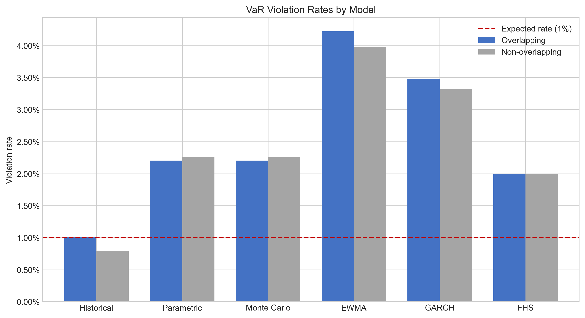

# Market Risk Validation Framework

An end-to-end Python framework for rolling VaR forecasting, forward-PnL backtesting, and comparative model validation.

## Overview

This project applies and interprets several Value-at-Risk (VaR) methodologies within a common portfolio and model-validation framework. Its primary objective is to examine how different modeling assumptions affect estimated market risk and whether the resulting VaR forecasts are consistent with realized portfolio losses.

Historical Simulation, variance-covariance VaR, and Monte Carlo Simulation are first used to compare static risk estimates and their underlying distributional assumptions. The analysis then moves from point-in-time measurement to rolling five-day VaR forecasts, with each forecast aligned to the realized forward PnL at the same forecast origin.

Model performance is evaluated through violation frequencies, unconditional coverage, violation independence, conditional coverage, and Basel-style traffic-light diagnostics. Overlapping and non-overlapping backtesting samples are reported separately to distinguish model calibration from dependence mechanically introduced by multi-day PnL windows.

EWMA, GARCH(1,1), and Filtered Historical Simulation are subsequently introduced to examine whether time-varying volatility and empirically resampled shocks improve tail-risk measurement relative to the baseline models. Expected Shortfall is included as a supplementary static measure of loss severity beyond the VaR threshold.

Rather than treating VaR as a single reported number, the project focuses on three practical questions:

* How do methodology and distributional assumptions affect estimated VaR?
* Do observed losses breach the forecasts at a frequency consistent with the stated confidence level?
* How should backtesting results be interpreted when the holding period creates overlapping realized PnL?

## Key Findings

* **Historical VaR provided the best overall calibration in this reference run.** Its violation rate was 1.01% in the full overlapping sample and 0.80% in the non-overlapping sample, both close to the 1% rate implied by a 99% VaR model.

* **Parametric and Monte Carlo VaR materially underestimated tail risk.** Both produced an overlapping violation rate of 2.21%. Their results were nearly identical because both models used the same historical covariance structure and normal-distribution assumption.

* **Dynamic volatility modeling did not automatically improve coverage.** EWMA and GARCH produced violation rates of 4.22% and 3.53%, respectively. Updating conditional volatility was not sufficient to capture the observed multi-day tail losses under normal innovations and square-root-of-time scaling.

* **FHS was the strongest volatility-based extension.** Its 1.99% violation rate was materially lower than those of EWMA and GARCH because it combined GARCH volatility filtering with empirically resampled standardized residuals. However, it still exceeded the expected 1% rate and did not achieve full coverage at the 5% significance level.

* **Coverage and independence provide different information.** Historical VaR passed the non-overlapping Kupiec coverage test with a p-value of 0.561, while its independence p-value of 0.034 indicated some remaining evidence of breach dependence. Its joint conditional-coverage p-value was 0.089.

* **Full overlapping and non-overlapping samples are reported separately.** The non-overlapping sample reduces the mechanical serial dependence created by overlapping five-day PnL windows and provides a more appropriate basis for the independence and conditional-coverage tests.

## Reference Portfolio and Configuration

The portfolio is intentionally simplified to provide a transparent environment for comparing model behavior. It is not intended to replicate the positions, risk factors, or operational constraints of a trading-desk portfolio.

### Portfolio Composition

| Asset                               | Ticker  | Market exposure                       | Weight | Price field    |
| ----------------------------------- | ------- | ------------------------------------- | -----: | -------------- |
| KOSPI Composite Index               | `^KS11` | Broad Korean main-board equities      |    25% | Close          |
| Kosdaq Composite Index              | `^KQ11` | Korean secondary-market and growth-oriented equities |    25% | Close          |
| iShares 7–10 Year Treasury Bond ETF | `IEF`   | Intermediate US Treasury bonds        |    25% | Adjusted Close |
| S&P 500 Index                       | `^GSPC` | US large-cap equities                 |    25% | Close          |

IEF uses Adjusted Close to reflect distributions and other price adjustments. The equity indices use unadjusted closing index levels.

### Reference Run

| Setting                          | Reference value                              |
| -------------------------------- | -------------------------------------------- |
| Sample period                    | 2006-01-03 to 2025-12-30                     |
| Price observations               | 4,774                                        |
| Rolling backtesting observations | 3,764                                        |
| Non-overlapping observations     | 753                                          |
| Portfolio notional               | USD 1,000,000                                |
| Portfolio weights                | Constant 25% weights                         |
| Return measure                   | Daily log returns                            |
| VaR confidence level             | 99%                                          |
| Holding period                   | 5 trading days                               |
| Rolling estimation window        | 1,000 observations                           |
| Monte Carlo simulations          | 10,000                                       |
| EWMA decay factor                | 0.94                                         |
| EWMA initialization window       | 60 observations                              |
| GARCH specification              | Zero-mean GARCH(1,1) with normal innovations |
| FHS simulations                  | 2,000 per forecast                           |
| FX assumption                    | FX-neutral; exchange-rate movements and hedging costs are not modeled |
| Random seed                      | 42                                           |
| Reference run identifier         | market-risk-2006-2025-seed42                 |

### Data and Modeling Conventions

* Market data are obtained through Yahoo Finance and preserved in a local snapshot for reproducible reference results.
* Asset return series are aligned to their common available dates before portfolio returns are calculated.
* Constant portfolio weights are applied to each day’s asset returns, corresponding to an implicitly rebalanced constant-mix portfolio rather than a buy-and-hold allocation.
* Parametric, Monte Carlo, EWMA, and GARCH VaR assume zero expected return over the short forecast horizon.
* Multi-day normal VaR estimates use square-root-of-time scaling.
* KOSPI and Kosdaq are included to broaden the test portfolio beyond US markets and expose the models to local-equity returns with different volatility and tail characteristics. Korean index returns are evaluated in local-currency terms, while the USD 1 million portfolio value serves only as a common notional for converting returns into monetary VaR and PnL. The results therefore represent an FX-neutral methodological benchmark rather than the realized risk of an unhedged USD investor.

